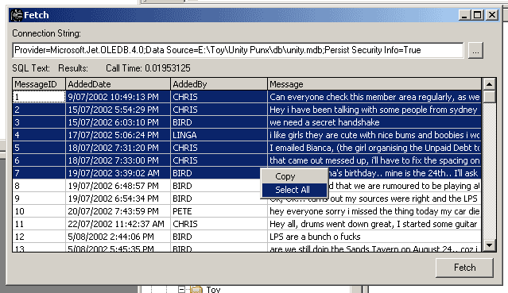



## Fetch ADO DB Querier

### Description

A quick little app for querying an OLEDB / ODBC database
 
### More Info
 

             |
---                |---
**Submitted On**   |2002-10-15 07:38:04
**By**             |[Chris Raethke](https://github.com/Planet-Source-Code/PSCIndex/blob/master/ByAuthor/chris-raethke.md)
**Level**          |Beginner
**User Rating**    |5.0 (20 globes from 4 users)
**Compatibility**  |VB 6\.0
**Category**       |[Databases/ Data Access/ DAO/ ADO](https://github.com/Planet-Source-Code/PSCIndex/blob/master/ByCategory/databases-data-access-dao-ado__1-6.md)
**World**          |[Visual Basic](https://github.com/Planet-Source-Code/PSCIndex/blob/master/ByWorld/visual-basic.md)
**Archive File**   |[Fetch\_ADO\_14881610282002\.zip](https://github.com/Planet-Source-Code/chris-raethke-fetch-ado-db-querier__1-40211/archive/master.zip)

